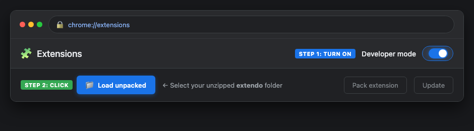

<div align="center">
  
  <h1>Extendo</h1>
  <p><b>Supercharge your LeetCode Playground experience.</b></p>
  <p>VS Code line shortcuts, authentic LeetCode dark mode, custom line highlights, a draggable STDIN slider, and a bounded code/output column divider.</p>
</div>

---

## ✨ Features

- ⚡ **VS Code Keyboard Shortcuts**: Move and duplicate lines up or down effortlessly.
- 🌙 **Authentic Dark Mode**: Official LeetCode dark gray (`#262626`), crisp white cursor, and exact Python syntax highlighting.
- 🎨 **Line Highlight Colors**: 8 customizable active line highlight tints (Blue, Yellow, Green, Red, Magenta, Pink, Orange, White).
- ↕️ **Resizable STDIN**: Drag up/down to give test input more room. Your preferred height is remembered.
- ↔️ **Resizable Columns**: Drag the full-height code/output divider between **40% and 83.33%** of the page width.
- 🎛️ **Independent Slider Toggles**: Enable or disable **Resize STDIN** and **Resize columns** separately in the popup.
- 🔒 **Playground Only**: Runs on LeetCode Playground pages (`leetcode.com` and `leetcode.cn`, including subdomains).

---

## 🎚️ Make the Playground Fit Your Workflow

Open Extendo’s popup to find **Resize STDIN** and **Resize columns**. Both are enabled by default and work in light and dark themes.

| Slider | How to use it | Limits & reset |
| :--- | :--- | :--- |
| ↕️ **STDIN height** | Expand LeetCode’s **stdin** button, then drag the handle above it up or down. | Starts at **200px**. Stops before covering the output header. Double-click to reset. |
| ↔️ **Column width** | Drag the vertical handle between the code editor and output. | Code takes **40%–83.33%** of the page width. Double-click to restore the original **58.33%** split. |

**Output and STDIN stay together in the right column.** Resizing STDIN changes its height; resizing columns changes the width of the entire code/output layout. At the rightmost limit, output and STDIN still have one-sixth of the page width.

Your height and column position are saved across playgrounds and reloads. Turning a slider off restores that part of LeetCode’s original layout; turning it back on restores your saved size. The master extension switch pauses both sliders too.

**Keyboard controls:** Focus a handle with <kbd>Tab</kbd>. Use <kbd>↑</kbd>/<kbd>↓</kbd> for STDIN or <kbd>←</kbd>/<kbd>→</kbd> for columns. Hold <kbd>Shift</kbd> for larger steps; <kbd>Home</kbd>/<kbd>End</kbd> jump to the limits.

---

## ⌨️ Keyboard Shortcuts

| Action | macOS | Windows / Linux |
| :--- | :--- | :--- |
| **Duplicate Line Down** | <kbd>⌥</kbd> + <kbd>⇧</kbd> + <kbd>↓</kbd> | <kbd>Shift</kbd> + <kbd>Alt</kbd> + <kbd>↓</kbd> |
| **Duplicate Line Up** | <kbd>⌥</kbd> + <kbd>⇧</kbd> + <kbd>↑</kbd> | <kbd>Shift</kbd> + <kbd>Alt</kbd> + <kbd>↑</kbd> |
| **Move Line Down** | <kbd>⌥</kbd> + <kbd>↓</kbd> | <kbd>Alt</kbd> + <kbd>↓</kbd> |
| **Move Line Up** | <kbd>⌥</kbd> + <kbd>↑</kbd> | <kbd>Alt</kbd> + <kbd>↑</kbd> |

---

## 🚀 How to Install

### Step 1: Get the Code (Choose ONE Option)

<table>
  <tr>
    <th width="50%" align="center">📦 Option A: 1-Click ZIP (Easiest — No Git)</th>
    <th width="50%" align="center">⚡ Option B: Git Clone (Terminal / Git Bash)</th>
  </tr>
  <tr valign="top">
    <td>
      <ol>
        <li>👉 <a href="https://github.com/dumpydon/extendo/raw/main/extendo.zip"><b>Download extendo.zip</b></a><br>
        <i>(or click green <b>&lt;&gt; Code</b> button &rarr; <b>Download ZIP</b>)</i></li>
        <li><b>Extract / Unzip</b> the file on your computer.</li>
      </ol>
    </td>
    <td>
      <p>Run this in Terminal or Git Bash:</p>
      <code>git clone https://github.com/dumpydon/extendo.git</code>
    </td>
  </tr>
</table>

---

### Step 2: Load into Google Chrome (30 Seconds)

1. Open Google Chrome and copy & paste this URL into your address bar:
   ```text
   chrome://extensions
   ```
   *(Or click **⋮ Menu** (top-right) &rarr; **Extensions** &rarr; **Manage Extensions**)*

2. **Turn ON Developer Mode**: Switch the toggle in the top-right corner.
3. **Load Extendo**: Click the **Load unpacked** button in the top-left corner and select your unzipped `extendo` folder.

<p align="center">
  
</p>

🎉 **You're all set!** Open any [LeetCode Playground](https://leetcode.com/playground/) and Extendo is ready to use!

---

### 🗺️ Installation Flow

```text
Extendo Setup
├── [Option A] 1-Click ZIP Download ──► Unzip folder ──┐
│                                                      ├──► chrome://extensions ──► Developer Mode (ON) ──► Load unpacked ──► 🎉 Ready!
└── [Option B] Git Clone ──────────────────────────────┘
```

---

## 🔄 Updating an Existing Installation

1. **Get the latest files:** ZIP users can [download the updated ZIP](https://github.com/dumpydon/extendo/raw/main/extendo.zip) and extract it into their existing extension folder. Git users can run `git pull` inside their checkout.
2. Open `chrome://extensions`, find **Extendo**, and click **Reload**.
3. Refresh your open playground tabs. The popup should show **v1.6.1**, **Resize STDIN**, and **Resize columns**.

> 💡 Refreshing the website alone does **not** reload the extension’s updated manifest or content scripts. If you extracted to a new folder, use **Load unpacked** to select that folder instead.

---

## 🛠️ Development & Checks

Run the lifecycle tests with Node.js:

```sh
node --test tests/*.test.cjs
```

These cover drag limits, keyboard controls, saved preferences, toggle cleanup, collapse/reopen, and handle replacement using a minimal DOM fixture.

For browser checks, serve the project locally:

```sh
python3 -m http.server 8765 --bind 127.0.0.1
```

Open `http://127.0.0.1:8765/tests/fixtures/columns.html`. The fixture runs both production resize scripts with mock extension storage against the inspected Playground layout. Check both drag limits, independent toggles, dark mode, and reload persistence. Verify the unpacked extension on LeetCode too; the fixture does not include the live editor or iframe.

The resize scripts run in the isolated world inside the Playground iframe. They target the existing editor and console containers without moving the editor, output, or input nodes. Preferences use `chrome.storage.local`.

### 📦 Rebuild the Download ZIP

```sh
python3 scripts/package.py
```

This rebuilds `extendo.zip` from the current extension files, README, privacy policy, icons, and README images, then verifies its contents. Run it after changing files intended for distribution so the one-click download stays in sync with the repo.

---

## 📄 License

MIT License. Free and open source.

