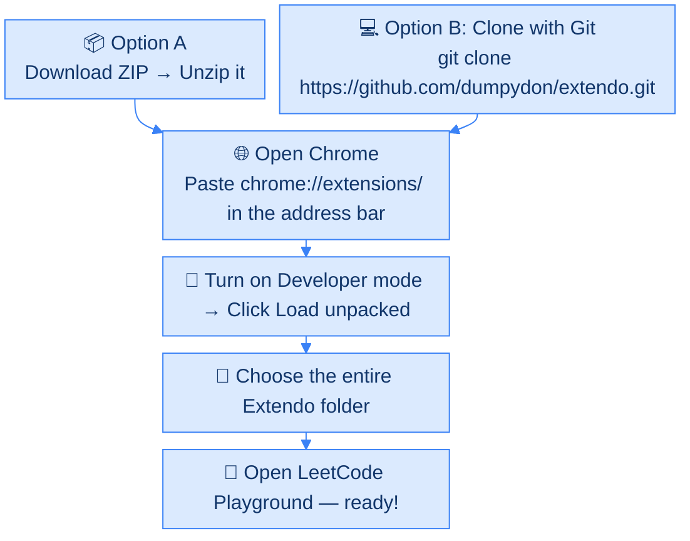

  
  <h1>Extendo</h1>
  
<b>Supercharge your LeetCode Playground experience.</b>

  
VS Code line shortcuts, authentic LeetCode dark mode, custom line highlights, a draggable STDIN slider, and a bounded code/output column divider.

---

## ✨ Features

- ⚡ **VS Code Keyboard Shortcuts**: Move and duplicate lines up or down effortlessly.
- 🌙 **Authentic Dark Mode**: Official LeetCode dark gray (`#262626`), crisp white cursor, and exact Python syntax highlighting.
- 🎨 **Line Highlight Colors**: 8 customizable active line highlight tints (Blue, Yellow, Green, Red, Magenta, Pink, Orange, White).
- ↕️ **Resizable STDIN**: Expand **stdin**, then drag its top handle up/down. For keyboard control, focus it with <kbd>Tab</kbd> and use <kbd>↑</kbd>/<kbd>↓</kbd>; hold <kbd>Shift</kbd> for bigger steps, or <kbd>Home</kbd>/<kbd>End</kbd> for the limits. Double-click to reset. Height saves automatically.
- ↔️ **Resizable Columns**: Drag the code/output divider between **40% and 83.33%** of the page width; STDIN stays on the right. Focus with <kbd>Tab</kbd> and use <kbd>←</kbd>/<kbd>→</kbd>; hold <kbd>Shift</kbd> for bigger steps, or <kbd>Home</kbd>/<kbd>End</kbd> for the limits. Double-click to reset. Position saves automatically.
- 🎛️ **Independent Slider Toggles**: Enable or disable **Resize STDIN** and **Resize columns** separately in the popup.
- 🔒 **Playground Only**: Runs on LeetCode Playground pages (`leetcode.com` and `leetcode.cn`, including subdomains).

---

## ⌨️ Keyboard Shortcuts

| Action | macOS | Windows / Linux |
| :--- | :--- | :--- |
| **Duplicate Line Down** | <kbd>⌥</kbd> + <kbd>⇧</kbd> + <kbd>↓</kbd> | <kbd>Shift</kbd> + <kbd>Alt</kbd> + <kbd>↓</kbd> |
| **Duplicate Line Up** | <kbd>⌥</kbd> + <kbd>⇧</kbd> + <kbd>↑</kbd> | <kbd>Shift</kbd> + <kbd>Alt</kbd> + <kbd>↑</kbd> |
| **Move Line Down** | <kbd>⌥</kbd> + <kbd>↓</kbd> | <kbd>Alt</kbd> + <kbd>↓</kbd> |
| **Move Line Up** | <kbd>⌥</kbd> + <kbd>↑</kbd> | <kbd>Alt</kbd> + <kbd>↑</kbd> |

---

## 🚀 How to Install

### 1. Get Extendo — choose A or B

<table>
  <tr>
    <th width="50%">📦 Option A: Download ZIP</th>
    <th width="50%">⚡ Option B: Use Git</th>
  </tr>
  <tr valign="top">
    <td>
      
<b>Recommended — no terminal needed.</b>

      <ol>
        <li><a href="https://github.com/dumpydon/extendo/raw/main/extendo.zip"><b>Download Extendo</b></a>.</li>
        <li>Unzip it: double-click on Mac, or right-click → <b>Extract All</b> on Windows.</li>
        <li>Keep the extracted folder in Documents or another permanent location.</li>
      </ol>
    </td>
    <td>
      
Run this in your terminal:

      <pre><code>git clone https://github.com/dumpydon/extendo.git</code></pre>
      
This creates an <b>extendo</b> folder. Use it in the steps below.

    </td>
  </tr>
</table>

### 2. Add it to Chrome — same steps for both options

1. Open **Google Chrome**, paste `chrome://extensions/` into the address bar, and press **Enter**.
2. Turn on **Developer mode** in the top-right corner.
3. Click **Load unpacked** in the top-left corner.
4. Choose the **entire extracted or cloned Extendo folder**.

### 3. Start using it

Open [LeetCode Playground](https://leetcode.com/playground/), or refresh it if already open. Done! Click Chrome’s puzzle-piece **Extensions** button, then **Extendo**, to find its settings.

---

### 🗺️ Installation at a Glance

---

## 🔄 Updating an Existing Installation

1. **Get the latest files:** ZIP users can [download the updated ZIP](https://github.com/dumpydon/extendo/raw/main/extendo.zip) and extract it into their existing extension folder. Git users can run `git pull` inside their checkout.
2. Open `chrome://extensions`, find **Extendo**, and click **Reload**.
3. Refresh your open playground tabs. The popup should show **v1.6.1**, **Resize STDIN**, and **Resize columns**.

> 💡 Refreshing the website alone does **not** reload the extension’s updated manifest or content scripts. If you extracted to a new folder, use **Load unpacked** to select that folder instead.

---

## 📄 License

MIT License. Free and open source.

