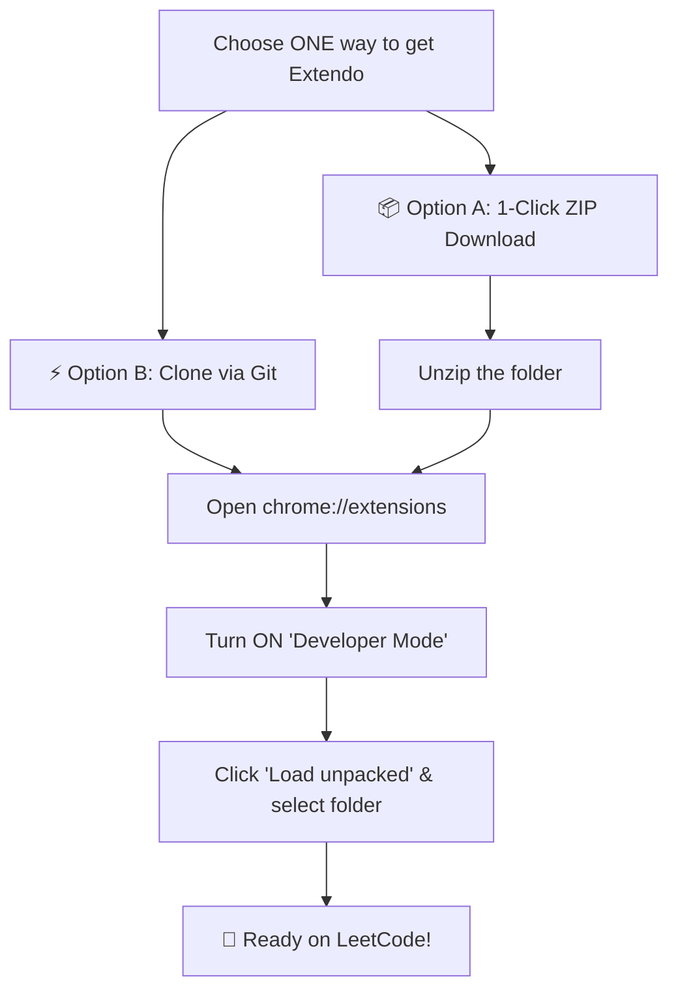

<div align="center">
  
  <h1>Extendo</h1>
  <p><b>Supercharge your LeetCode Playground experience.</b></p>
  <p>VS Code line shortcuts, authentic LeetCode dark mode, custom line highlights, and a draggable stdin curtain slider.</p>
</div>

---

## ✨ Features

- ⚡ **VS Code Keyboard Shortcuts**: Move and duplicate lines up or down effortlessly.
- 🌙 **Authentic Dark Mode**: Official LeetCode dark gray (`#262626`), crisp white cursor, and exact Python syntax highlighting.
- 🎨 **Line Highlight Colors**: 8 customizable active line highlight tints (Blue, Yellow, Green, Red, Magenta, Pink, Orange, White).
- ↕️ **Stdin Curtain Slider**: Drag to resize the `stdin` input panel, featuring a centered pill notch and an electric blue hover glow.
- 🔒 **Zero Bloat & Safe**: Runs strictly on `leetcode.com/playground/*`. Never touches other LeetCode pages.

---

## ⌨️ Keyboard Shortcuts

| Action | macOS | Windows / Linux |
| :--- | :--- | :--- |
| **Duplicate Line Down** | <kbd>⌥</kbd> + <kbd>⇧</kbd> + <kbd>↓</kbd> | <kbd>Shift</kbd> + <kbd>Alt</kbd> + <kbd>↓</kbd> |
| **Duplicate Line Up** | <kbd>⌥</kbd> + <kbd>⇧</kbd> + <kbd>↑</kbd> | <kbd>Shift</kbd> + <kbd>Alt</kbd> + <kbd>↑</kbd> |
| **Move Line Down** | <kbd>⌥</kbd> + <kbd>↓</kbd> | <kbd>Alt</kbd> + <kbd>↓</kbd> |
| **Move Line Up** | <kbd>⌥</kbd> + <kbd>↑</kbd> | <kbd>Alt</kbd> + <kbd>↑</kbd> |

---

## 🚀 How to Install



### Step 1: Get the Code (Choose ONE Option)

<table>
  <tr>
    <th width="50%" align="center">📦 Option A: 1-Click ZIP (Easiest — No Git)</th>
    <th width="50%" align="center">⚡ Option B: Git Clone (Terminal / Git Bash)</th>
  </tr>
  <tr valign="top">
    <td>
      <ol>
        <li>👉 <a href="https://github.com/dumpydon/extendo/raw/main/extendo.zip"><b>Download extendo.zip</b></a><br>
        <i>(or click green <b>&lt;&gt; Code</b> button &rarr; <b>Download ZIP</b>)</i></li>
        <li><b>Extract / Unzip</b> the file on your computer.</li>
      </ol>
    </td>
    <td>
      <p>Run this in Terminal or Git Bash:</p>
      <code>git clone https://github.com/dumpydon/extendo.git</code>
    </td>
  </tr>
</table>

---

### Step 2: Load in Google Chrome (30 Seconds)

1. Open Google Chrome and go to:
   ```
   chrome://extensions
   ```
2. Turn **ON** the **Developer mode** toggle in the top-right corner.
3. Click the **Load unpacked** button in the top-left corner.
4. Select the unzipped `extendo` folder.

🎉 **Done!** Open any [LeetCode Playground](https://leetcode.com/playground/) and enjoy!

---

## 📄 License

MIT License. Free and open source.

